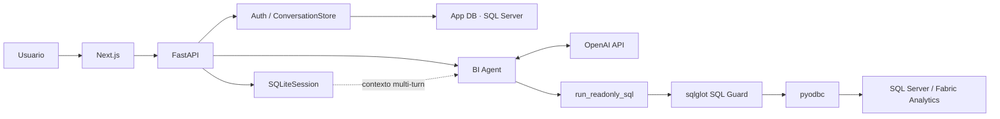

# BI Agent

Asistente interno de Business Intelligence que convierte preguntas en lenguaje natural en consultas SQL gobernadas y responde con datos reales de ventas, productos y tiendas.


## Overview

BI Agent permite que un equipo consulte información comercial sin escribir SQL manualmente. El usuario pregunta en español, un agente genera T-SQL, la aplicación valida la consulta, SQL Server/Fabric devuelve las filas y el agente construye una respuesta comprensible.

```text
pregunta → agente → SQL → validación read-only → datos → respuesta
```

El diseño prioriza confiabilidad y seguridad: el modelo solo accede a una herramienta de lectura, cada consulta pasa por validación AST y la identidad analítica tiene permisos restringidos. Si no existe una ejecución SQL exitosa, el agente no debe inventar cifras.

## Key Features

- Preguntas BI en lenguaje natural y conversaciones multi-turn.
- T-SQL generado directamente por el agente con hasta 3 intentos por turno.
- Guard AST con `sqlglot` y whitelist estricta de tres views.
- Métricas comerciales, comparativos temporales y análisis de ventas, productos y tiendas.
- Contexto geográfico por país, departamento/estado, ciudad y macrozona.
- Autenticación local, administración de usuarios y cambio de contraseña obligatorio.
- Conversaciones, mensajes y auditoría aislados por usuario.
- Historial con búsqueda, renombrado y eliminación de conversaciones.
- Auditoría de turnos e intentos SQL, incluidos tiempos, errores y truncamiento.
- Uso de modelo, tokens, duración y costo estimado por respuesta cuando hay tarifa registrada.
- Respuestas Markdown, tablas navegables y exportación a Excel.

## Architecture



La **App DB** y la **Analytics DB** son bases independientes con credenciales y responsabilidades diferentes. La primera almacena usuarios, sesiones web, conversaciones y auditoría. El agente no puede consultarla: su única herramienta SQL apunta a la base analítica. `SQLiteSession` conserva el contexto multi-turn del agente por conversación.

## How it works

1. El usuario envía una pregunta desde el chat.
2. FastAPI valida su sesión y el ownership de la conversación.
3. El agente interpreta el contexto y genera una consulta T-SQL.
4. `run_readonly_sql` limita los intentos y envía la consulta al guard AST.
5. El guard exige una sola consulta de lectura sobre las views autorizadas.
6. `pyodbc` ejecuta la consulta con timeout y una identidad analítica read-only.
7. El agente interpreta las filas y redacta la respuesta; la UI presenta texto Markdown y, cuando aplica, una tabla.
8. La App DB persiste mensajes, uso y auditoría de cada intento SQL.

## Data Model

| View | Propósito | Campos representativos |
| --- | --- | --- |
| `dbo.VW_SalesLast13Months` | Hechos de venta de aproximadamente los últimos 13 meses | tienda, ticket, producto, fecha, valor vendido, cantidad y valor unitario |
| `dbo.VW_Stores` | Dimensión de tiendas y contexto comercial/geográfico | actividad económica, país, departamento/estado, ciudad, macrozona, estrato y fecha de implementación |
| `dbo.VW_Products` | Catálogo y atributos de producto | nombre, EAN, fabricante, marca, categoría, subcategoría, línea, sabor y presentación |

Joins oficiales:

```sql
dbo.VW_SalesLast13Months.idStore = dbo.VW_Stores.idPartner
dbo.VW_SalesLast13Months.idProduct = dbo.VW_Products.productId
```

La jerarquía geográfica es `countryName → stateName → cityName → macrozone`. La macrozona se toma exclusivamente de `VW_Stores.macrozone`: puede repetirse entre ciudades y un valor nulo significa que todavía no está disponible.

## BI Metrics

| Métrica | Definición |
| --- | --- |
| Sales | `SUM(totalSaleValue)` |
| Units | `SUM(productQuantity)` |
| Tickets | `COUNT(DISTINCT uniqueTicketPerStore)` |
| Average price | ventas / unidades |
| Average ticket | ventas / tickets |
| Rotation | unidades / tiendas distintas que venden la entidad |
| Penetration | tiendas que venden la entidad / tiendas activas en el mismo contexto |
| Share | ventas o unidades de la entidad / universo comparado |
| DN | tiendas que venden la entidad / tiendas que venden la categoría |
| Frequency | tickets / tiendas que venden la entidad |
| Units/ticket | unidades / tickets |
| MoM | valor del mes actual / valor del mes anterior − 1 |

Los filtros temporales, geográficos y de producto se aplican de forma consistente al numerador y al universo de comparación.

## Security & Reliability

- Solo acepta `SELECT` o `WITH ... SELECT`; bloquea DDL, DML, `EXEC` y `SELECT INTO`.
- Exige una sola sentencia y rechaza otras bases, linked servers y objetos fuera de la whitelist.
- Valida T-SQL mediante el AST de `sqlglot`, no con coincidencias de texto.
- Permite como máximo 3 intentos SQL por turno.
- Devuelve como máximo 200 filas a la aplicación, sin limitar las agregaciones internas.
- Usa un timeout configurable de 600 segundos por defecto.
- Conecta a Analytics con `ApplicationIntent=ReadOnly` y requiere una identidad con permisos `SELECT` únicamente sobre las tres views.
- Mantiene credenciales de OpenAI y SQL Server exclusivamente en el backend.
- Usa cookies de sesión `HttpOnly`, `SameSite=Lax` y `Secure` en producción.
- Protege contraseñas con Argon2id y almacena un hash SHA-256 del token de sesión.
- Aísla conversaciones y auditoría por `user_id` y registra cada intento SQL.
- Deshabilita el tracing del SDK y la captura de datos sensibles del modelo y las herramientas.

> La validación de aplicación complementa los permisos reales de SQL Server; no los sustituye.

## Tech Stack

| Capa | Tecnologías |
| --- | --- |
| Frontend | Next.js 16.3.4, React 19.2.8, TypeScript 5.9.3, React Markdown |
| Backend | Python 3.11, FastAPI 0.141.1, Uvicorn, Pydantic Settings |
| AI | OpenAI Agents SDK 0.22.1, OpenAI Responses API |
| Analytics | SQL Server / Microsoft Fabric, `pyodbc` 5.3.0, `sqlglot` 28.10.1 |
| App DB | SQL Server, SQLAlchemy 2.0.52 |
| Sessions | SQLite mediante `SQLiteSession` del Agents SDK |
| Export | `openpyxl` 3.1.5 |
| Testing | pytest 8.4.2, Ruff 0.16.6, ESLint 9.39.1 |

## Getting Started

### Prerequisites

- Python 3.11
- Node.js y npm compatibles con Next.js 16
- ODBC Driver 18 for SQL Server
- Acceso a una Analytics DB en SQL Server/Fabric
- Acceso de lectura/escritura a una App DB independiente
- Una OpenAI API key

### Backend

Desde la raíz del repositorio, en PowerShell:

```powershell
py -3.11 -m venv .venv
.\.venv\Scripts\Activate.ps1
python -m pip install -e ".[dev]"
Copy-Item .env.example .env
```

Completa `.env` con la API key, las conexiones `ANALYTICS_DB_*` y `APP_DB_*`, y los valores opcionales de timeout, modelo y ruta de sesiones. No uses la identidad analítica para la App DB ni publiques este archivo.

### App DB

Las migraciones son manuales. Ejecútalas una vez en la **App DB**, con un usuario autorizado, en este orden:

1. `apps/api/migrations/001_phase4a_app_db.sql`
2. `apps/api/migrations/002_phase4b_local_auth.sql`
3. `apps/api/migrations/003_phase4c_usage.sql`

Para crear el primer administrador, configura antes del primer arranque:

```dotenv
BOOTSTRAP_ADMIN_USERNAME=
BOOTSTRAP_ADMIN_PASSWORD=
BOOTSTRAP_ADMIN_DISPLAY_NAME=
```

Los tres valores son obligatorios para el bootstrap. El usuario solo se crea cuando la tabla de usuarios está vacía y deberá cambiar la contraseña temporal al iniciar sesión. Define los secretos localmente; no los incluyas en commits, documentación o logs.

Inicia la API:

```powershell
uvicorn bi_agent_api.main:app --reload
```

La API queda disponible en `http://localhost:8000` y expone `GET /health` para comprobar la App DB.

### Frontend

En otra terminal:

```powershell
Set-Location apps/web
Copy-Item .env.local.example .env.local
npm install
npm run dev
```

`NEXT_PUBLIC_API_URL` apunta por defecto a `http://localhost:8000`. El frontend queda disponible en `http://localhost:3000`.

## Usage Examples

- “¿Cuáles fueron las ventas de la marca X en Bogotá el mes pasado?”
- “Muéstrame los 10 productos con mayores ventas en Medellín este año.”
- “¿Qué share en unidades tuvo la marca X frente a las marcas Y y Z en la categoría?”
- “Calcula la penetración de la marca X por macrozona dentro de Cali.”
- “Compara las ventas del último mes contra el anterior y calcula el MoM.”
- Follow-up: “Ahora Medellín” o “¿Y por unidades?” para conservar el resto del contexto.

## API

| Grupo | Endpoints principales |
| --- | --- |
| Auth | `POST /api/v1/auth/login`, `POST /api/v1/auth/logout`, `GET /api/v1/auth/me`, `POST /api/v1/auth/change-password` |
| Conversations | `POST /api/v1/conversations`, `GET /api/v1/conversations`, `PATCH /api/v1/conversations/{conversation_id}`, `DELETE /api/v1/conversations/{conversation_id}` |
| Messages | `GET /api/v1/conversations/{conversation_id}/messages`, `POST /api/v1/conversations/{conversation_id}/messages` |
| Admin | `GET/POST /api/v1/admin/users`, `PATCH /api/v1/admin/users/{user_id}`, `POST /api/v1/admin/users/{user_id}/activate`, `POST /api/v1/admin/users/{user_id}/deactivate`, `POST /api/v1/admin/users/{user_id}/reset-password` |
| Excel | `POST /api/v1/exports/excel` |

Las rutas de negocio requieren la cookie de sesión; las rutas administrativas también exigen un usuario administrador.

## Testing

Backend y controles del repositorio:

```powershell
python -m pytest
python -m ruff check .
git diff --check
```

Frontend:

```powershell
Set-Location apps/web
npm run lint
npm run build
```

El proyecto incluye tests deterministas para API, autenticación, persistencia, agente y seguridad SQL; evals BI con casos versionados; un dataset holdout; y un smoke test live opcional. Las pruebas live requieren opt-in explícito mediante `RUN_LIVE_EVALS=1` o `RUN_SQL_LIVE_SMOKE=1` y pueden consumir tokens o consultar la Analytics DB.

## Project Structure

```text
bi-agent-v2/
├── apps/
│   ├── api/       # FastAPI, agente, seguridad SQL, App DB y tests
│   └── web/       # Aplicación Next.js
├── docs/          # Producto, arquitectura y reglas BI
├── evals/         # Casos de evaluación y holdout
└── scripts/       # Evals y smoke tests opcionales
```

## Project Status

Las capacidades funcionales principales del MVP están implementadas: chat multi-turn, consultas gobernadas contra datos reales, autenticación, aislamiento por usuario, historial, auditoría, telemetría de uso y exportación Excel.

El siguiente paso es el deployment y la productización del sistema para su entorno operativo.

## Documentation

- [Product Goal](docs/01-product-goal.md)
- [Data Model](docs/02-data-model.md)
- [Architecture](docs/03-architecture.md)
- [SQL Safety](docs/04-sql-safety.md)
- [System Prompt](docs/05-system-prompt.md)
- [SQL Examples](docs/06-sql-examples.md)
- [Testing & Evals](docs/07-testing-evals.md)
- [Implementation Plan](docs/08-implementation-plan.md)
