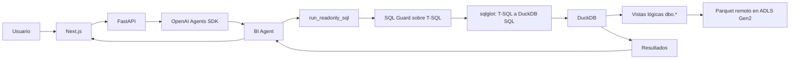
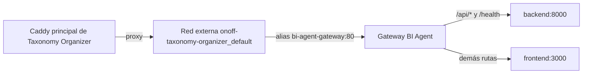

# 02 - Arquitectura

## Flujo productivo

El agente genera T-SQL directamente. El backend valida esa sentencia, la transpila a DuckDB SQL y la ejecuta únicamente sobre las tres vistas creadas desde Parquet en ADLS. Después el resultado vuelve al agente para redactar la respuesta.

## Persistencia separada

| Componente | Propósito |
| --- | --- |
| App DB | SQL Server independiente para usuarios, sesiones web, conversaciones, mensajes, auditoría y uso. Se conecta con SQLAlchemy/pyodbc. |
| `SQLiteSession` | Contexto multi-turn del Agents SDK por conversación. Se conserva en el volumen Docker configurado por `SESSION_DB_PATH`. |
| ADLS Gen2 + DuckDB | Fuente analítica. DuckDB crea las vistas lógicas sobre los Parquet remotos durante la ejecución. |

La App DB no es una fuente de métricas y el agente no puede consultarla mediante `run_readonly_sql`.

## Entrada HTTPS y contenedores

El HTTPS público termina en el Caddy principal de Taxonomy Organizer. El gateway local de BI Agent no publica puertos al host: solo expone el puerto 80 dentro de las redes Docker. No se usa `cloudflared` ni Quick Tunnel en el despliegue actual.

## Principios de diseño

- Un solo agente con un system prompt fuerte, schema, joins, métricas, reglas temporales y ejemplos SQL.
- Una única tool analítica: `run_readonly_sql(sql: string)`.
- Guardrails simples y demostrables: AST de `sqlglot`, whitelist de vistas, límite de filas, timeout y máximo de intentos.
- Las reglas de negocio viven principalmente en el prompt y en ejemplos SQL claros.
