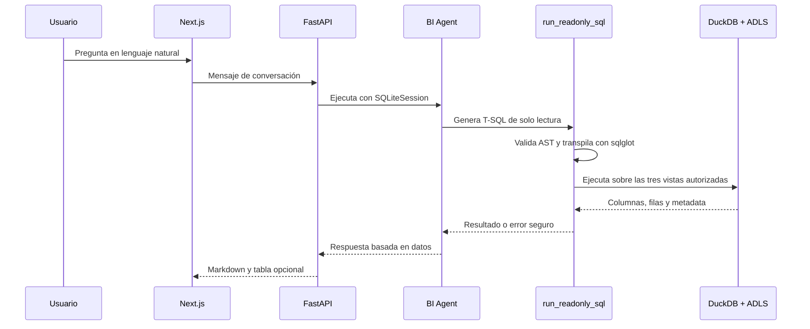

# 05 - Flujo del agente

## Turno normal

## Reglas de ejecución

1. Entender la pregunta y resolver ambigüedades materiales.
2. Generar SQL directamente, sin DSL ni compilador propio.
3. Ejecutar `run_readonly_sql`.
4. Revisar el resultado.
5. Si la consulta falla, corregirla y reintentar.
6. Responder solo con resultados SQL exitosos.

El máximo es de 3 ejecuciones SQL por turno. El agente no muestra SQL por defecto; solo lo muestra cuando el usuario lo solicita explícitamente.

## Resolución de productos y ambigüedades

- Para un SKU descrito por nombre, buscar primero pocos candidatos en `VW_Products`.
- Si quedan varios candidatos plausibles, mostrar diferencias útiles y pedir confirmación.
- Si se pide “más importantes” sin métrica, preguntar el criterio.
- Si se da un mes sin año y la fecha no se puede determinar con seguridad, preguntar.
- No repetir en follow-ups la resolución de una entidad ya establecida.

## Respuestas confiables

- Empezar por la conclusión y mencionar el período.
- No convertir cero filas en una métrica igual a cero.
- Distinguir “sin filas coincidentes”, agregado `0` y agregado `NULL`.
- Indicar si el resultado fue truncado.
- En preguntas “por qué”, describir únicamente factores observables en las vistas: ventas, unidades, precio medio, tiendas, penetración, rotación, tickets y share.
- No atribuir resultados a promociones, clima, campañas, competencia externa u otras causas no presentes en los datos.
