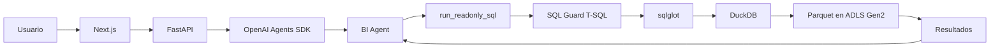

# BI Agent

Asistente interno de Business Intelligence para consultar ventas, productos y tiendas con datos reales, SQL gobernado y respuestas comprensibles para el equipo de BI.

## Acceso y fuente

| Elemento | Valor |
| --- | --- |
| URL productiva | [bi-agent.132-196-100-163.sslip.io](https://bi-agent.132-196-100-163.sslip.io) |
| Health | [GET /health](https://bi-agent.132-196-100-163.sslip.io/health) |
| Repositorio Azure DevOps | [Agente BI](https://dev.azure.com/onoff-solution/BI/_git/Agente%20BI) |
| Repositorio original | [juanbedoya1603/bi-agent-v2](https://github.com/juanbedoya1603/bi-agent-v2) |
| Rama desplegada | `migration/adls-gen2` |
| Ruta productiva | `C:\Aplicaciones\bi-agent-v2` |

## Qué resuelve

El usuario pregunta en lenguaje natural. El agente genera una consulta T-SQL de solo lectura, la valida, consulta las vistas lógicas sobre Parquet en ADLS Gen2 y devuelve una conclusión con tabla cuando corresponde. Conserva contexto multi-turn por conversación.

## Arquitectura resumida

La entrada HTTPS la termina el Caddy principal de Taxonomy Organizer, que enruta hacia `bi-agent-gateway`; el gateway dirige `/api/*` y `/health` al backend y el resto al frontend. La App DB es SQL Server independiente, conectada con SQLAlchemy/pyodbc. `SQLiteSession` conserva el contexto multi-turn del Agents SDK.

## Stack principal

- Frontend: Next.js, React y TypeScript.
- Backend: Python 3.11, FastAPI, Uvicorn y Pydantic Settings.
- Agente: OpenAI Agents SDK.
- Analítica: DuckDB, `sqlglot` y Parquet remoto en ADLS Gen2.
- App DB: SQL Server con SQLAlchemy/pyodbc.
- Sesiones: `SQLiteSession` en volumen Docker persistente.
- Operación: Docker Compose y Caddy.

## Estado actual

- La migración del executor analítico a DuckDB + ADLS Gen2 está completada.
- El deployment productivo está completado.
- `migration/adls-gen2` es la rama actualmente desplegada.
- Data Engineering todavía debe validar el histórico completo cargado en ADLS: fechas, volúmenes, esquemas y resultados de métricas.
- No hacer merge a `main` hasta terminar y aprobar esa validación.

## Navegación

- [01 - Objetivo y alcance](01-objetivo-y-alcance.md)
- [02 - Arquitectura](02-arquitectura.md)
- [03 - Modelo de datos](03-modelo-de-datos.md)
- [04 - Métricas BI](04-metricas-bi.md)
- [05 - Flujo del agente](05-flujo-del-agente.md)
- [06 - Seguridad SQL](06-seguridad-sql.md)
- [07 - Despliegue](07-despliegue.md)
- [08 - Operación y troubleshooting](08-operacion-y-troubleshooting.md)
- [09 - Usuarios y seguridad](09-usuarios-y-seguridad.md)
- [10 - Testing y evals](10-testing-y-evals.md)
- [11 - Data Engineering y ADLS](11-data-engineering-y-adls.md)
- [12 - Handoff y pendientes](12-handoff-y-pendientes.md)

> Esta Wiki no contiene secretos. No publicar API keys, passwords, connection strings, PAT, tokens ni contenido de `.env`.
